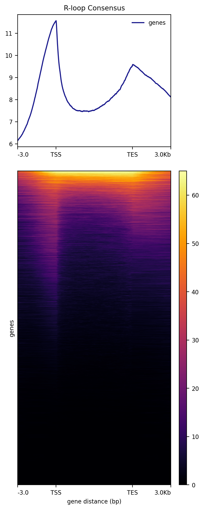

```{r setup, warning=FALSE, message=FALSE, echo=FALSE, include=FALSE}
knitr::opts_knit$set(root.dir = rprojroot::find_rstudio_root_file())
knitr::knit_hooks$set(optipng = knitr::hook_optipng)
knitr::opts_chunk$set(warning = FALSE, message = FALSE, 
                      cache = TRUE, optipng='', cache.lazy = FALSE,
                      echo = TRUE)
```

```{r libraries}
library(magrittr)
library(tidyverse)
library(ChIPpeakAnno)
library(regioneR)
library(rtracklayer)
library(magrittr)
library(enrichR)
library(EnsDb.Hsapiens.v86)
library(TxDb.Hsapiens.UCSC.hg38.knownGene)
library(ChIPseeker)

RLOOP_PEAKS <- "analyses/RLoop_Table_Analysis/data/rloops/strategy.a__10bp__peaks.narrowPeak"
RL_BW <- "analyses/RLoop_Table_Analysis/data/counts/strategy.a__10bp__counts.bw"
GENE_BED <- "misc/genes.bed"
RLOOP_MAT_TSS <- "analyses/RLoop_Table_Analysis/data/rloops/rloop_mat.tss.npz"
RLOOP_MAT_GENE <- "analyses/RLoop_Table_Analysis/data/rloops/rloop_mat.gene.npz"
RLOOP_IMG_GENE <- "analyses/RLoop_Table_Analysis/data/rloops/rloop_mat.gene.png"
RLOOP_PDF_GENE <- "analyses/RLoop_Table_Analysis/data/rloops/rloop_mat.gene.pdf"
RL_BW_URI <- "s3://rmapdb-data/misc/rloop_consensus.bw"
RL_PEAKS_URI <- "s3://rmapdb-data/misc/rloop_consensus.narrowPeak"
MAX_RL_SIZE <- 5000
THREADS <- floor(parallel::detectCores() / 1.2)

system("rm -rf analyses/RLoop_Table_Analysis/data/peaksFinal"); dir.create("analyses/RLoop_Table_Analysis/data/peaksFinal", showWarnings = FALSE)
rmap <- read_csv("analyses/scored_rmap_full_11_17_2020.csv")
rmap %<>%
  dplyr::filter(mode_group %in% "DRIP",
         genome == "hg38",
         Condition == "S9.6",
         MACS2__total_peaks > 1500 & xgbverdict == 1) %>%
  dplyr::mutate(peak = paste0("analyses/RLoop_Table_Analysis/data/peaks/", sample_name, "_hg38.unstranded.broadPeak")) %>%
  dplyr::filter(file.exists(peak)) %T>% {
    pull(., peak) %>%
    sapply(file.copy, to="analyses/RLoop_Table_Analysis/data/peaksFinal")
  }


# Annotations
annoData <- ChIPpeakAnno::toGRanges(EnsDb.Hsapiens.v86, feature = "gene")
rtracklayer::export(annoData, con = GENE_BED)
# TSS region
tss <- getPromoters(TxDb=TxDb.Hsapiens.UCSC.hg38.knownGene, 
                    upstream=3000, 
                    downstream=3000)

# Annotation function
annoRL <- function(gr, max_rl_size) {
  gr <- gr[width(gr) < max_rl_size,]
  gr <- keepStandardChromosomes(gr, pruning.mode = "coarse")
  anno <- annotatePeakInBatch(myPeakList = gr, AnnotationData = annoData, 
                      output = "overlapping")
  anno <- anno[! is.na(anno$feature),]
  annodf <- as.data.frame(anno)
  mapping <- AnnotationDbi::select(EnsDb.Hsapiens.v86, 
                                   keys = keys(EnsDb.Hsapiens.v86), 
                                   columns = "SYMBOL")
  annodf <- left_join(annodf, mapping , by = c('feature' = "GENEID"))
  anno$SYMBOL <- annodf$SYMBOL 
  return(anno)
}

# Read RLoops
readRL <- function(x, max_rl_size) {
  readr::read_tsv(x, comment = "#", col_names = c(
    "seqnames", "start", "end", "name", "score", "strand", "signalValue", "pval", "qval", "peak"
  )) %>%
    dplyr::filter(end - start < max_rl_size) %>%
    as.data.frame() %>%
    ChIPpeakAnno::toGRanges() 
}

urlExists <- function(url) {
  identical(
    httr::status_code(
      # Checks HEAD only due to size constraints
      httr::HEAD(
        url
      )
    ), 200L  # Checks if response is ok
  )
}


checkRLFSAnno <- function(genome) {
  return(
    urlExists(
      paste0(
        "https://rmapdb-data.s3.us-east-2.amazonaws.com/rlfs-beds/", 
        genome, ".rlfs.bed"
      )
    )
  )
}

getRLFSAnno <- function(genome) {
  
  # Check if annotations available first
  if (! checkRLFSAnno(genome)) {
    stop("No RLFS annotations available for ", genome)
  }
  
  # Return as a GRanges object
  return(
    regioneR::toGRanges(
      as.data.frame(
        suppressMessages(readr::read_tsv(
          paste0(
            "https://rmapdb-data.s3.us-east-2.amazonaws.com/rlfs-beds/", 
            genome, ".rlfs.bed"
          ),
          col_names = FALSE))
      )
    )
  )
}


```

# Overview

We evaluated the output from the various strategies used to generate a set of standardized Rloops.


```{r}
rmap %<>%
  mutate(Cell = case_when(
    Group == "Li" ~ "Breast Tissue",
    TRUE ~ Cell
  )) %>%
  dplyr::select(Sample=clean_name, Mode=mode, Tissue=Cell, `RLoops Detected`=MACS2__total_peaks)  %T>%
  {tableone::CreateTableOne(vars = c("RLoops Detected", "Mode", "Tissue"), data=.) %>%
  print()}
```

The table of samples can be observed here:

```{r}
DT::datatable(rmap)
```


## Results

```{r}
rloops <- readRL(RLOOP_PEAKS, max_rl_size=MAX_RL_SIZE)
rlAnno <- annotatePeak(rloops, verbose = FALSE, TxDb = TxDb.Hsapiens.UCSC.hg38.knownGene)
annotRL <- annoRL(rloops, max_rl_size = MAX_RL_SIZE) %>% as.data.frame
# if (! file.exists(RLOOP_MAT_TSS) | ! file.exists(RLOOP_MAT_GENE)) {
#   system(paste0(". ~/miniconda3/etc/profile.d/conda.sh && conda activate deeptools && ",
#                 "computeMatrix reference-point -S ", RL_BW, " -p ", THREADS, 
#                 " --verbose --missingDataAsZero -b 3000 -a 3000 --skipZeros	",
#                 " -R ", GENE_BED, " --referencePoint TSS -o ", RLOOP_MAT_TSS))
#   system(paste0(". ~/miniconda3/etc/profile.d/conda.sh && conda activate deeptools && ",
#                 "computeMatrix scale-regions -S ", RL_BW, " -p ", THREADS, 
#                 " --verbose --missingDataAsZero -b 3000 -a 3000 --skipZeros	",
#                 " -R ", GENE_BED, " -m 6000 -o ", RLOOP_MAT_GENE))
#   system(paste0("plotHeatmap --matrixFile ", RLOOP_MAT_GENE, 
#                 " --outFileName ", RLOOP_IMG_GENE," --heatmapWidth 8 --heatmapHeight 19 ",
#                 " --colorMap inferno --samplesLabel 'R-loop Consensus'"))
#   system(paste0("plotHeatmap --matrixFile ", RLOOP_MAT_GENE, 
#                 " --outFileName ", RLOOP_PDF_GENE," --heatmapWidth 8 --heatmapHeight 19 ",
#                 " --colorMap inferno --samplesLabel 'R-loop Consensus'"))
#   system(paste0("aws s3 --region us-west-2 cp ", RL_BW, " ", RL_BW_URI, " --acl public-read"))
#   system(paste0("aws s3 --region us-west-2 cp ", RLOOP_PEAKS, " ", RL_PEAKS_URI, " --acl public-read"))
# }
```




```{r}
plotAnnoPie(rlAnno)
```


```{r}
hist(width(rloops), breaks = 100, xlab = "R-Loop Width", main = "R-loop consensus peak width", col="firebrick")

```


```{r}
# Check RLFS, chrom_sizes, and mask
RLFS <- getRLFSAnno("hg38")

# Prevent stranded assignment
GenomicRanges::strand(RLFS) <- "*"
RLFS <- GenomicRanges::reduce(RLFS)

```

```{r}

pt <- regioneR::permTest(A=rloops, B=RLFS, 
                         genome="hg38", 
                         randomize.function=regioneR::circularRandomizeRegions,
                         evaluate.function=regioneR::numOverlaps, verbose = T
                         # alternative = "greater"
                         )

```

```{r}

z <- regioneR::localZScore(A=rloops, B=RLFS, pt, window = 5000, step = 50)

```


```{r}
plot(pt)

```


```{r}

plot(z)
```

```{r}

rlrlfsol <- findOverlapsOfPeaks(list(
  "RLoops" = rloops,
  "RLFS" = RLFS
))
makeVennDiagram(rlrlfsol, margin = .05, fill = c("firebrick", "skyblue"))
```

```{r}

symbs <- annotRL %>%
  as.data.frame() %>%
  dplyr::filter(! is.na(SYMBOL)) %>%
  pull(SYMBOL) %>%
  unique()
write_csv(as_tibble(symbs), "asd.csv")

annoData %>%
  as.data.frame() %>%
  dplyr::filter(! gene_name %in% symbs)
  

```
